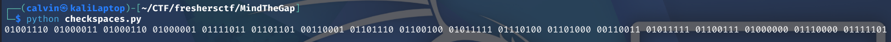
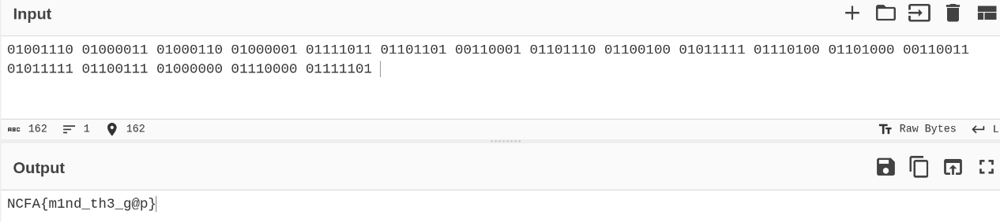

# Mind The Gap

Mind the gap was a quick and easy cryptography/steganography challenge.  
We are provided with the file message.txt (which is also in this directory):

```Attention all  operatives, the following  briefing  is  classified and must  not leave this channel under  any  circumstances whatsoever.  Our analysts intercepted chatter  from  the opposing squad  late last night and the picture  is finally  becoming  clear  to  us. They  believe  their perimeter  is  secure, yet  every  message they  send betrays a  little  more than they intend  to reveal.  Remember  that the  smallest  details  are the ones  defenders  overlook, and it  is precisely in those  gaps that  we  operate  best.  Stay  patient, stay  quiet,  and  read carefully,  because nothing here is  truly  empty even  when it appears to be so  at  first glance. The  mission  depends on  your attention  to  the  spaces  between  the obvious,  so  trust your instincts,  count  what  others ignore,  and report back only once you are absolutely  certain  that  you have found what was hidden  in  plain  sight  before  you. Good  luck```

The title of the challenge becomes relevant when we realise that the number of spaces between each word varies between 1 and 2.  
Given that this could represent 2 states, my first thought is that this could be binary, so I write a quick python script to check:

```
message = open("message.txt", "r")
text = message.read()
message.close()

currentspaces=0
binary=""
counter=0
for i in range(len(text)):
	if text[i] == " ":
		currentspaces+=1
	else:
		if currentspaces>0:
			counter+=1
			binary = binary + str(currentspaces-1)
			if counter % 8 == 0:
				binary = binary +" "
			currentspaces=0
print(binary)
```



Using CyberChef to decode this, we get our flag:

