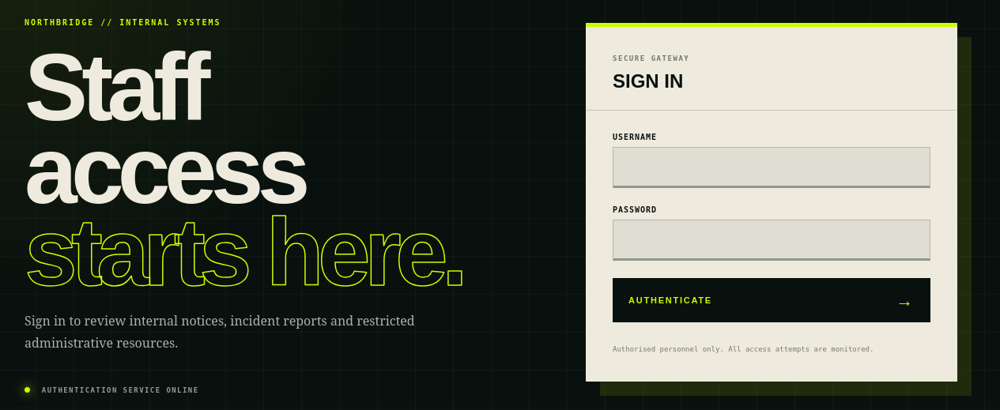
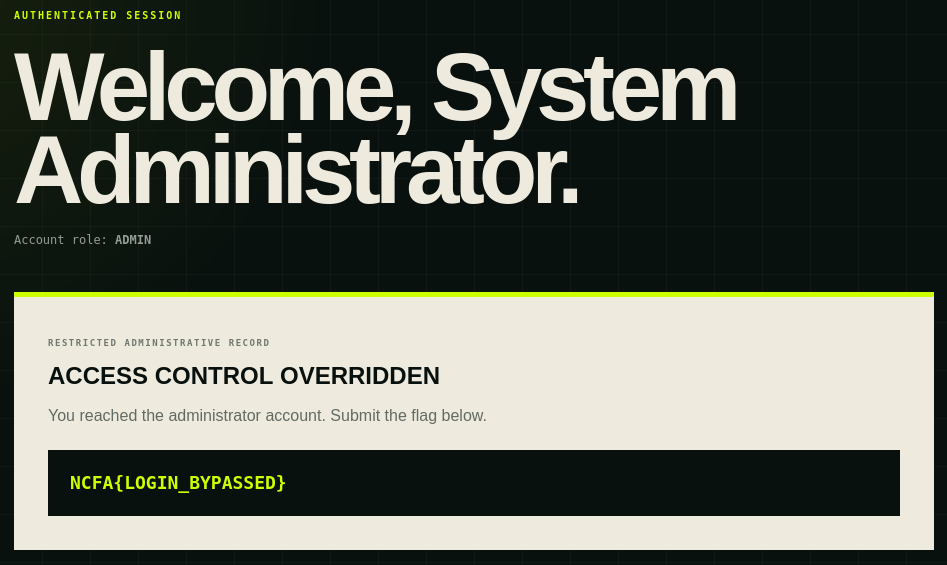

# Northbridge SQL Injection

This was the only web challenge of the CTF, and was simple and straightforward, with the title effectively giving us the answer. Opening the webpage in the browser displays this site:

Given the name of the challenge, SQLI for authentication bypass seems like an obvious first move, so I try to log in as admin with the password ' OR 1=1;, which gives us the flag:

## N.B

Our team, Hackchester, was the first to solve this challenge:

