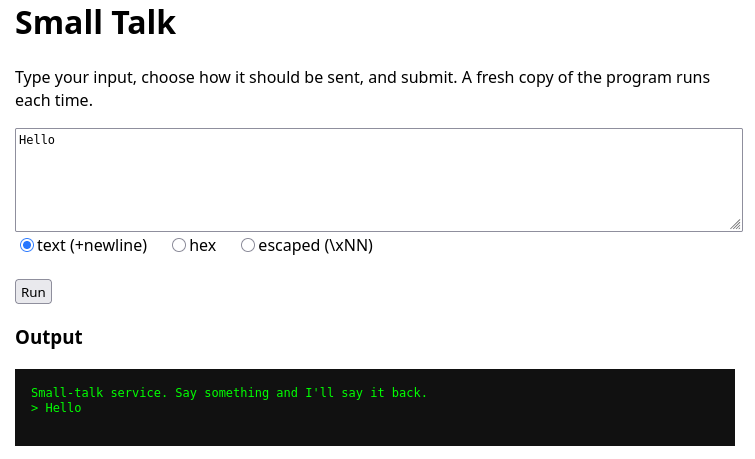
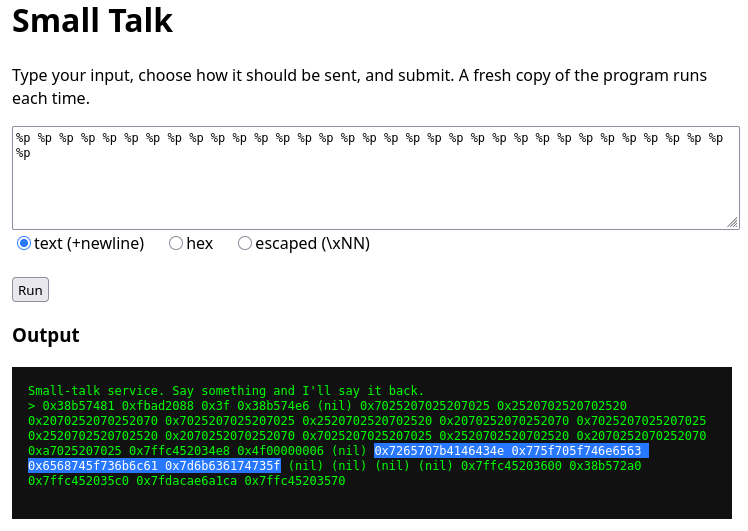
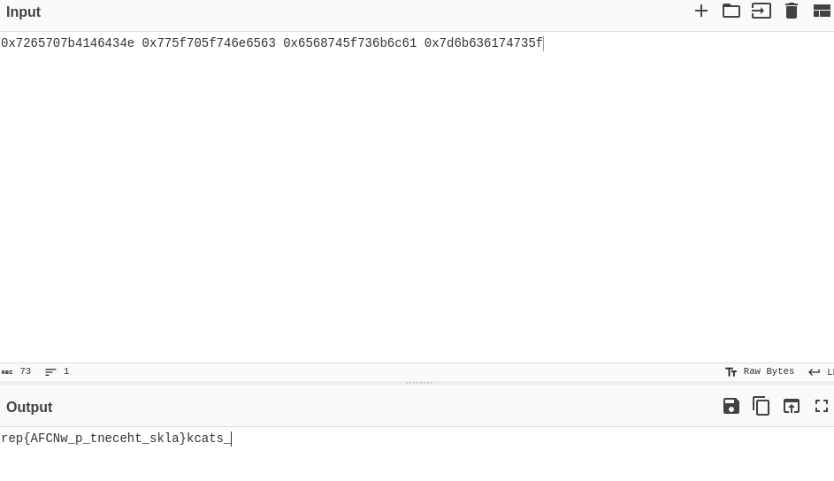

# Small Talk

In this challenge, we are provided with a web interface that we can use to interact with the program echo.c, running on their server, where flag.txt is stored. This is what the interface looks like:



We are also given the source code and executable for echo.c:

```
#include <stdio.h>
#include <stdlib.h>
#include <string.h>

int main(void)
{
    setvbuf(stdout, NULL, _IONBF, 0);

    char secret[64];
    memset(secret, 0, sizeof secret);
    FILE *f = fopen("flag.txt", "r");
    if (f) { if (fgets(secret, sizeof secret, f)) {} fclose(f); }
    secret[strcspn(secret, "\r\n")] = 0;   /* keep it as a local */

    char input[128];
    puts("Small-talk service. Say something and I'll say it back.");
    printf("> ");
    if (!fgets(input, sizeof input, stdin)) return 0;

    printf(input);                         /* BUG: uncontrolled template */
    printf("\n");

    /* touch secret so the compiler keeps the local around */
    if (secret[0] == 1) puts(secret);
    return 0;
}
```

This program contains a format string vulnerability, where printf(input) is called. Since secret, which holds  the flag, is stored on the stack, we can use the format string vulnerability to read the stack and therefore the secret:



The highlighted section does not change when the program is run repeatedly, so I suspect this is where the secret is stored. Using cyberchef, we can turn this into a more readable form:



This output is still slightly muddled up, with each group of 8 characters being reversed, but undoing this by hand is quick and gives us the flag:  
NCFA{percent_p_walks_the_stack}